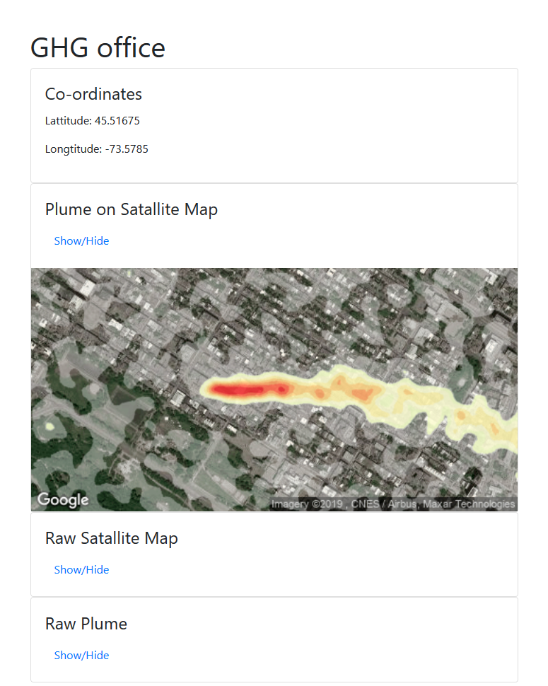

# PLUMIFY

An app for visualizing plumes on a map. Just enter the co-ordinates, upload a plume and presto!



## Getting Started

If you want to use this app, you can easily get it running with Docker.

First edit `sercrets.py` to set the `GOOGLE_API_KEY` (which you should have gotten a copy of, or [set up your own](https://developers.google.com/maps/documentation/maps-static/intro))


And then just run:

```
docker-compose up
```

And visit

http://127.0.0.1:8000

## Development

To develop this app you need to first install [pipenv](https://pipenv.kennethreitz.org/en/latest/)

Next you can install all the python packages and setup a virtual env automatically with:

```
pipenv install --dev
```

Next you will need to set up the database. You can do that with:

```
scripts/migrate
```

Then you can start the development server with

```
scripts/server
```

(just an alias for `python manage.pry runserver`)


### Testing

You can run the tests with

```
script/tests
```

which is just an alias for `python manage.py test`